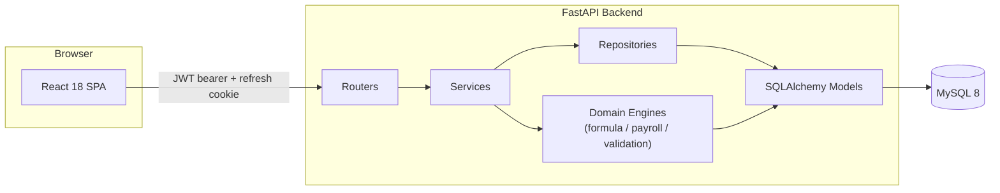
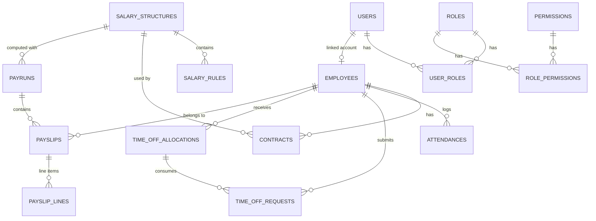
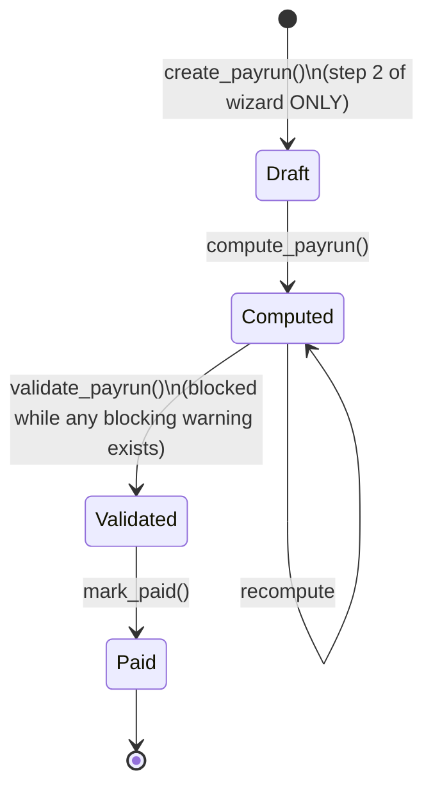
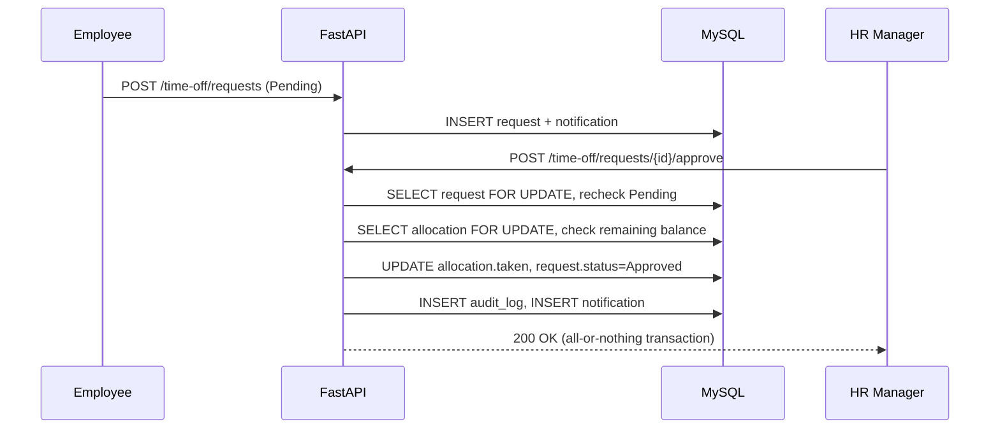
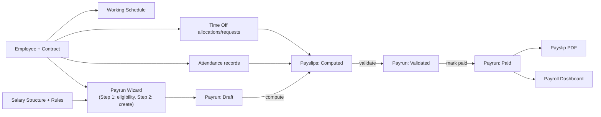

# PeoplePay360

## Team 726

- Sanket Prajapati - Team Leader
- Manav Joshi
- Reyan Vaghela
- Umang Vaza

An HR & Payroll ERP platform built for Odoo Hackathon 2026 Final — Team 726.

PeoplePay360 covers the full employee lifecycle from onboarding through payroll: employee
records, contracts, working schedules, attendance, time-off management, salary structures
and rules, payroll runs with a strict approval state machine, payslip PDFs, and a live
payroll dashboard — all backed by a real MySQL database with normalized role-based access
control.

## Tech stack

**Frontend:** React 18, Vite, Tailwind CSS, React Router, TanStack Query, Axios, React Hook
Form + Zod, Recharts, Lucide icons, date-fns, Sonner. JavaScript only — no TypeScript.

**Backend:** Python 3.11, FastAPI, Pydantic v2, SQLAlchemy 2.x, Alembic, PyMySQL,
python-jose (JWT), Argon2 password hashing, Uvicorn. All monetary values use
`Decimal`/`Numeric` — never `float`.

**Database:** MySQL 8.

No Docker is used anywhere in this project. Everything runs with a plain local Python
virtual environment, `npm`, and a locally installed MySQL server — see Setup below for the
exact commands.

## Architecture at a glance



Full write-up, request/response envelope, auth flow, and directory map:
[`docs/ARCHITECTURE.md`](docs/ARCHITECTURE.md).

## Entity-relationship diagram



Full ERD with every field and constraint note: [`docs/ERD.md`](docs/ERD.md).

## Payroll state machine



Every transition is checked against `PAYRUN_TRANSITIONS` server-side, regardless of what the
UI shows — an out-of-order transition attempted via a direct API call is rejected the same
way it would be from the browser. Details: [`docs/BUSINESS_RULES.md`](docs/BUSINESS_RULES.md).

## Leave approval workflow



A second approval attempt on the same request is rejected — the row lock plus post-lock
status recheck prevents double-approval and double-consumption of the allocation. Details:
[`docs/BUSINESS_RULES.md`](docs/BUSINESS_RULES.md).

## Employee → payslip flow



## RBAC model

Normalized RBAC (`users` / `roles` / `permissions` / `user_roles` / `role_permissions` +
`refresh_sessions` for server-side JWT refresh revocation) with 5 official roles and 39
distinct permission codes. Full matrix and demo credentials:
[`docs/RBAC.md`](docs/RBAC.md).

## Setup

### 1. MySQL

```sql
CREATE DATABASE peoplepay360 CHARACTER SET utf8mb4 COLLATE utf8mb4_unicode_ci;
CREATE USER 'pp360'@'localhost' IDENTIFIED BY 'change_me';
GRANT ALL PRIVILEGES ON peoplepay360.* TO 'pp360'@'localhost';
FLUSH PRIVILEGES;
```

### 2. Backend

```bash
cd backend
python3.11 -m venv venv
source venv/bin/activate
pip install -r requirements.txt
cp .env.example .env
# edit .env: DB_USER/DB_PASSWORD/DB_NAME to match step 1, and set a real JWT_SECRET_KEY
#   python -c "import secrets; print(secrets.token_hex(32))"
alembic upgrade head
python -m app.seed
uvicorn app.main:app --reload --port 8000
```

The API is live at `http://localhost:8000/api/v1` (docs at `http://localhost:8000/docs`).

### 3. Frontend

```bash
cd frontend
npm install
cp .env.example .env
npm run dev
```

Open `http://localhost:5173`.

Full backend-only and frontend-only instructions:
[`backend/README_BACKEND.md`](backend/README_BACKEND.md),
[`frontend/README_FRONTEND.md`](frontend/README_FRONTEND.md).

## Demo credentials

| Role | Email | Password |
|---|---|---|
| Admin | `admin@peoplepay360.com` | `Admin@123` |
| HR Manager | `hr.manager@peoplepay360.com` | `Hr@12345` |
| HR & Payroll User | `payroll.user@peoplepay360.com` | `Payroll@123` |
| HR & Payroll Manager | `payroll.manager@peoplepay360.com` | `Payroll@123` |
| Employee | `employee@peoplepay360.com` | `Employee@123` |

## Test results

```
Backend:  42 passed  (pytest -q)
Frontend: 18 passed  (npm run test)
```

Both suites are re-run and green at the time of packaging. See
[`docs/ACCEPTANCE_TEST.md`](docs/ACCEPTANCE_TEST.md) for what each suite covers and for the
two official end-to-end acceptance flows (Employee → Payslip, Leave request → approval),
both of which were manually verified against a live MySQL database including data
persistence across a full page reload. A suggested judge walkthrough is in
[`docs/DEMO_SCRIPT.md`](docs/DEMO_SCRIPT.md).

## Implemented requirements (PDF spec)

- Normalized RBAC schema (users/roles/permissions/user_roles/role_permissions) with 5
  official roles and server-side-enforced permissions, not a single role enum.
- JWT access tokens + HttpOnly-cookie refresh tokens, server-side refresh-session hashing
  and revocation.
- Employees, Contracts (with blocking overlap/conflict detection and period resolution),
  Working Schedules (with server-computed weekly hours), Attendance (present / late / absent
  / overtime / missing-checkout / manually-corrected), Time Off (Types, Allocations,
  Requests) with an atomic, row-locked approval transaction preventing double-approval and
  double-consumption of balances.
- Salary Structures and Salary Rules (Fixed / Percentage / Formula computation types) backed
  by an AST-based safe formula evaluator with no `eval`/`exec` anywhere in the codebase.
- Payroll: a two-step Payrun wizard where step 1 ("Continue") never creates a Payrun, an
  explicit Draft → Computed → Validated → Paid state machine enforced server-side against
  direct API calls (not just hidden UI), and duplicate-payslip prevention both in the
  service layer and via a database unique constraint.
- Decimal-only monetary arithmetic throughout (`Numeric(15,2)` columns, Python `Decimal`
  with explicit rounding) — never `float` for money.
- Payslip PDF generation (ReportLab) with an optional embedded QR code.
- An email adapter that reports `EMAIL_NOT_CONFIGURED` honestly when SMTP isn't set up,
  rather than claiming delivery.
- A Payroll Dashboard computing every KPI/chart/section live from MySQL: Total Net Salary
  Paid, Payslips Generated, Average Salary, Approved Time Off, Attendance Health, Salary
  Cost by Department (bar chart), Monthly Net Salary Trend (line chart), Payroll Alerts
  (non-blocking warnings), Attendance Overview, Time Off Overview, Department Breakdown.
- Audit logging of sensitive actions (contract changes, allocation/request approvals,
  payrun transitions, role changes) with JSON-safe before/after snapshots.
- Database-backed notifications (polling-based; see Known Limitations).
- Full CRUD screens for every entity above plus an Admin Users/Roles screen and a Reports
  landing page.
- Backend test suite (42 tests) and frontend smoke/unit tests (18 tests), both passing.
- Responsive layout tested at 1440 / 1024 / 768 / 390 widths.
- Enterprise seed data: 8 representative demo users, 250 employees across multiple departments/
  positions/employee types, 2+ schedules, active + historical + draft contracts, 3+
  time-off types with allocations/requests across Pending/Approved/Refused, attendance
  covering every listed status, 2 salary structures, and Payruns existing in **all four
  states simultaneously** (Draft, Computed, Validated, Paid).

## Implemented Excalidraw screens

Employee list/detail with smart-button tabs (Contracts/Attendance/Time Off/Allocations),
Contracts list/detail/form, Working Schedules list/detail/form, Attendance list/detail/form
with manual check-in/out, Time Off Types/Allocations/Requests (list/detail/form for each,
with Approve/Refuse actions gated by permission and status), Salary Structures/Rules
(list/detail/form), Payruns list, the two-step New Payrun wizard, Payrun detail with a
status-gated action toolbar and warnings banner, Payslip list/detail with PDF download, the
Payroll Dashboard, an Admin Users/Roles screen, and a Reports landing page.

## Differentiators actually implemented

- **Safe, sandboxed salary-formula evaluator** using Python's `ast` module with an explicit
  allow-list (no `eval`/`exec`, no attribute/subscript/function-call access) — this went
  beyond a minimal Fixed/Percentage-only implementation.
- **Server-side transition legality table** (`PAYRUN_TRANSITIONS`) enforced independently of
  the UI, verified by tests that call the API directly with illegal transitions.
- **Row-level locking (`SELECT ... FOR UPDATE`)** on both the time-off request and the
  allocation during approval, specifically to close the double-approval/double-consumption
  race condition rather than relying on optimistic checks alone.
- **Honest email-adapter status reporting** (`EMAIL_NOT_CONFIGURED` vs. `sent`) instead of a
  fire-and-forget send that silently no-ops.
- **QR-coded payslip PDFs** (best-effort, wrapped so a QR-generation failure never blocks PDF
  delivery).

The premium differentiators described in the original brief as stretch goals — a
"PayrollGuard" integrity engine, a "PayExplain" salary-change explainer, and a Payroll
Digital Twin simulator — were **not implemented**. Priority was deliberately given to
finishing and verifying every P0 requirement and both official acceptance flows against a
real MySQL database first, per the brief's own stated priority order
(correctness → compliance → real persistence → business logic → security → UX →
differentiation); with that fully done, time did not remain to build these three P1/P2
items, and they are disclosed here rather than claimed.

## Known limitations (disclosed honestly)

- The repository layer (`app/repositories/`) is fully built out for contract period
  resolution and overlap detection specifically, since that logic is reused and
  correctness-critical; other entities' queries live directly in their service modules
  rather than a repository wrapper, since they are simple CRUD with no reuse need.
- Payslip PDFs are generated with ReportLab rather than WeasyPrint (WeasyPrint's system
  dependencies were not reliably available in the target environment); output is a
  standard, correctly laid out PDF with the same required content.
- Notifications are database-backed and delivered via polling from the frontend; there is no
  WebSocket/push channel.
- No Docker packaging is provided, by design — the brief explicitly required a manual local
  setup, documented above.

## Repository layout

```
backend/    FastAPI application, Alembic migrations, seed script, pytest suite
frontend/   React + Vite SPA, Vitest suite
docs/       Architecture, ERD, business rules, RBAC, acceptance tests, demo script
```


## Enterprise Demo Dataset

The development seed creates 250 employee records and thousands of related HR/payroll records in MySQL. It demonstrates server-side pagination, search, filtering, real payroll computation and historical dashboard aggregation without frontend mock data or a UI rebuild.

From `backend` with the existing virtual environment:

```powershell
.\venv\Scripts\python.exe -m alembic upgrade head
.\venv\Scripts\python.exe -m app.seed
```

An empty database can be seeded directly. A completed enterprise seed is validated on repeat runs without adding rows. Existing non-enterprise data is never cleared by the default command. To explicitly replace development domain data:

```powershell
.\venv\Scripts\python.exe -m app.seed --reset
.\venv\Scripts\python.exe -m app.seed --verify
```

`--reset` first writes a typed, compressed JSON snapshot to `backend/.seed-backups/`, then replaces domain rows in one transaction. Existing users, password hashes and RBAC records are preserved. The snapshot contains private account data and is excluded from version control. This is an explicit development reset, not a production migration. Failures before commit roll back the domain replacement. The seed requires MySQL and `ENV=development`, uses the installed Alembic schema, and never runs during Uvicorn startup.

The fixture uses random seed **726** and a fixed reference date of **5 September 2026**. Business keys and generated values are deterministic; surrogate IDs and existing account hashes are preserved or database-assigned. Attendance covers the preceding 60 scheduled working days per employee, excluding approved leave dates. Payroll covers April?September 2026 with one run per salary structure: April?July Paid, August Validated, September Computed, plus a small October Draft. This produces 13 payruns, 1,501 payslips and 8,406 salary-rule lines. Earlier months without imported attendance correctly show zero recorded worked days; the existing wage-based payroll rules are not changed or prorated by the seed.

Expected fresh domain totals: 250 employees, 8 departments, 26 job positions, 3 employee types, 5 schedules, 295 contracts, 14,817 attendance rows, 4 leave types, 762 allocations, 420 leave requests, 2 salary structures, 9 rules, 150 notifications and 119 system audit entries. Five missing bank-account examples are introduced for September; previously computed Paid payslips retain their original records. Demo accounts have no seeded open attendance shift, allowing live check-in demonstrations.

All five official demo credentials remain unchanged. Additional Employee accounts are `aarav.sharma@peoplepay360.com`, `diya.patel@peoplepay360.com`, and `isha.nair@peoplepay360.com`, initially using `Employee@123`. Reset does not overwrite passwords of existing accounts.

For evaluation, open Employees to see the 250 total, search `EMP-0250`, switch between list and cards, and filter by department/type/status. Open Attendance, Requests, Allocations and Payslips to browse server pages. List APIs default to 20 and reject limits above 100. Small employee selection controls fetch bounded pages to make all 250 choices available (up to 500). Open Payroll Dashboard and select **1 April?30 September 2026** to review all six months; September alone intentionally contains Computed rather than Paid salaries. Dashboard totals aggregate database records, not the visible list page.

`python -m app.seed --verify` checks contracts, management cycles, schedules, allocation usage, payslip uniqueness/lines/totals and the live dashboard query. Read `ENTERPRISE_DATA_REPORT.md` for measured verification results and the precise changed-file list.


### Single check-in / checkout and scheduled breaks

Employees keep one check-in and one checkout per business day. Checkout finishes the day; it is not a break button. New check-ins snapshot the assigned schedule's break allowance for that weekday. For a completed shift lasting at least six hours, the allowance is deducted (capped at elapsed time). Shorter shifts have no automatic deduction. Example: 09:00?18:00 with a one-hour allowance gives nine hours on site, one hour scheduled break and eight net working hours. This policy uses scheduled allowances, not GPS or measured break activity.

HR can correct the deducted hours from Attendance ? record ? Correct; an explicit duration and correction reason are required, with an audit record. A break cannot exceed elapsed time. Existing historical rows are marked `Legacy`, retain their recorded worked hours and show that no break deduction was recorded. New/explicitly corrected net hours feed the existing attendance-status rules. This does not recalculate already-paid payslips or introduce multiple attendance sessions.
