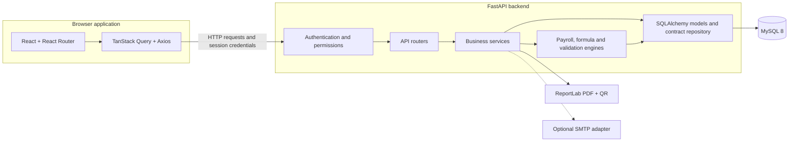
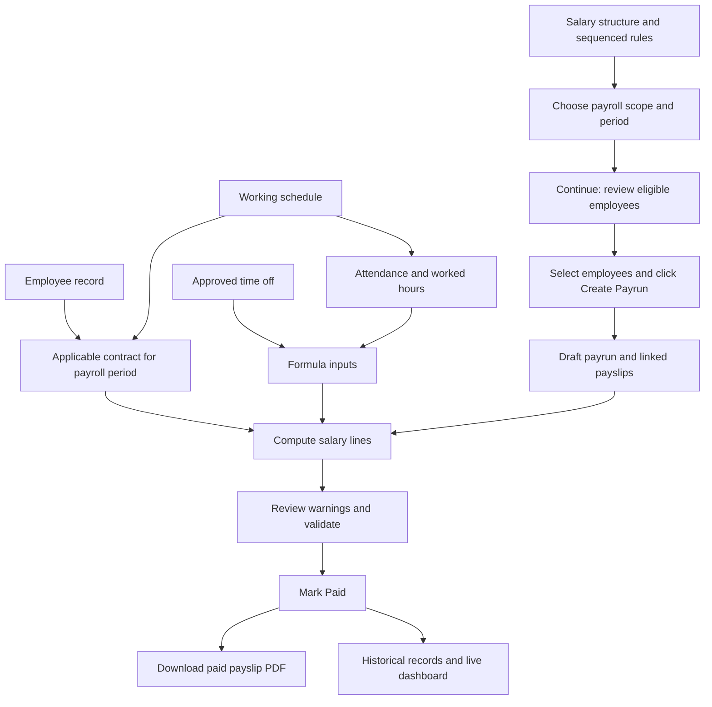
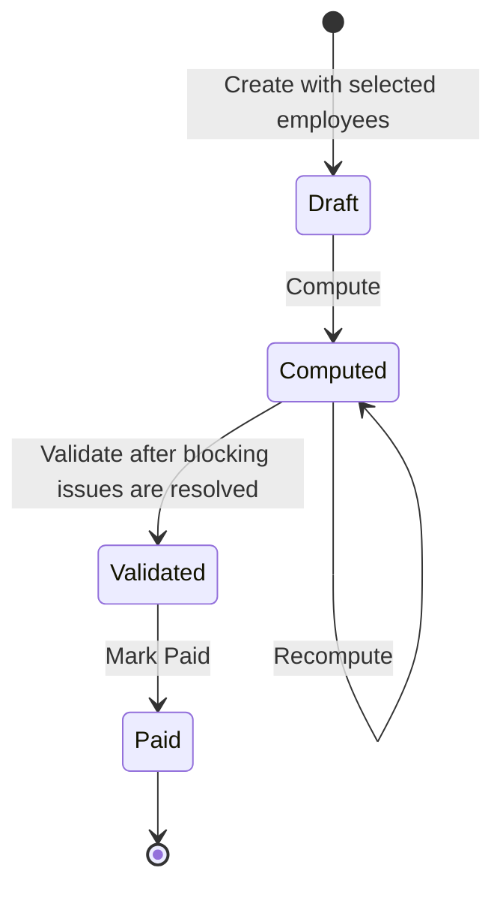
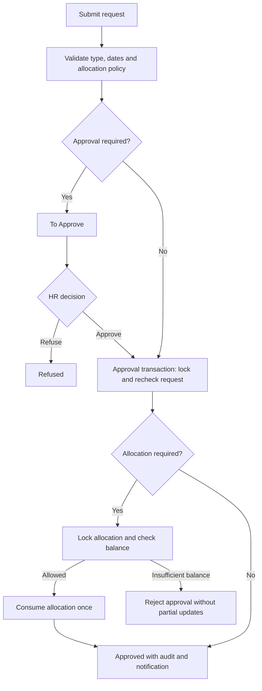
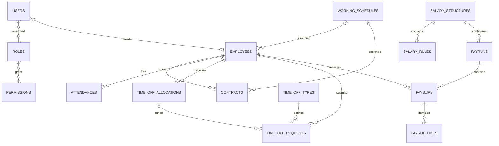

# PeoplePay360

### Your people. Your payroll. One connected platform.

**Odoo Hackathon 2026 | Team 726 | Final submission**

PeoplePay360 connects employee records, contracts, attendance, leave and payroll in one role-aware workspace. HR teams manage the employee lifecycle, payroll teams review and finalize salary runs, and employees access their own records and paid payslips. The application uses a React frontend, a FastAPI backend and persistent MySQL data.

| Team member | GitHub |
| --- | --- |
| Sanket Prajapati - Team Leader | [sanket913](https://github.com/sanket913) |
| Manav Joshi | [Manavjoshi2579](https://github.com/Manavjoshi2579) |

[Features](#features) · [Architecture](#architecture) · [Quick start](#quick-start) · [Demo accounts](#demo-accounts) · [Evaluation walkthrough](#evaluation-walkthrough) · [Verification](#verification) · [Scope and limitations](#scope-and-limitations)

## Features

| Module | Implemented functionality |
| --- | --- |
| Authentication and access | Admin-created accounts, employee linking, multiple roles, JWT authentication, refresh sessions and server-side permissions |
| Employees | List and card views, search, filters, pagination, employee details and related records |
| Contracts | Automatic references, contract history, overlap checks and payroll-period contract resolution |
| Working schedules | Weekly intervals, optional breaks, derived hours, overlap validation and employee/contract assignment |
| Attendance | Check-in/out widget, elapsed timer, attendance status, employee history, location checks and audited corrections |
| Time off | Configurable types, allocations, two-way date/day calculation, requests, approval/refusal and balance validation |
| Salary configuration | Ordered salary rules with Fixed, Percentage and safe arithmetic Formula calculations |
| Payroll | Two-step employee selection, payroll diagnostics and Draft → Computed → Validated → Paid processing |
| Payslips | Salary breakdown, paid-only PDF download, QR verification and ownership checks |
| Dashboard | Database-driven salary totals, department costs, trends, payslip statuses, attendance, leave and warnings |
| Notifications and audit | Persistent notifications, read/read-all actions and sensitive-action audit history |
| User experience | Responsive workspace, consistent navigation, pagination, animated landing page and success-only sign-in animation |

The final [Excalidraw requirements audit](EXCALIDRAW_REQUIREMENTS_AUDIT.md) maps the reference flows to implementation, verification and explicit policy choices.

## Architecture



| Layer | Technology |
| --- | --- |
| Frontend | React 18, Vite, Tailwind CSS, React Router, TanStack Query, Axios |
| Forms and charts | React Hook Form, Zod, Recharts, Lucide icons |
| Backend | Python, FastAPI, Pydantic, SQLAlchemy, Alembic, Uvicorn |
| Persistence | MySQL 8 through PyMySQL; Decimal/Numeric salary calculations |
| Authentication | JWT, Argon2 password hashing, persisted refresh sessions |
| Documents | ReportLab and QR code generation |
| Testing | Pytest, Vitest, Testing Library; Playwright browser checks |

### From employee to paid payslip



**Continue does not create a payrun.** Creation happens after employee selection. Attendance, schedule and unpaid-leave values affect salary when configured rules reference them.

### Payroll lifecycle



Transitions are enforced by the backend. Paid records remain available as history and cannot be recomputed. Fixed rules use their entered value, including zero; a Formula rule containing `WAGE` uses the applicable contract wage.

Formula context includes `WAGE`, `WORKED_DAYS`, `WORKED_HOURS`, `PERIOD_DAYS`, `SCHEDULED_DAYS`, `SCHEDULED_HOURS`, `OVERTIME_HOURS` and `UNPAID_DAYS`, alongside prior rule results. Expressions pass through an arithmetic AST allow-list.

### Leave approval and balance handling



Duplicate approval is rejected. Allocation-required paid leave cannot overdraw its balance. Requests use inclusive calendar days.

### Core data relationships

This diagram summarizes the main domain relationships; it is not the complete database schema.



Roles and permissions use association tables. Current permissions are read server-side, so revoked roles do not retain access through stale token claims. Users cannot change their own roles.

## Quick start

### Prerequisites

- Python 3.11 or a compatible newer Python installation
- Node.js 20 LTS and npm
- MySQL 8 running locally
- Git

The commands below use **Windows PowerShell**. No Docker setup is required.

### 1. Clone the repository

```powershell
git clone https://github.com/sanket913/odoo-hackathon-2026-team-726.git
cd odoo-hackathon-2026-team-726
```

### 2. Create the database

Run this in a MySQL administrator session. Replace the example password and use the same value in the backend configuration.

```sql
CREATE DATABASE peoplepay360 CHARACTER SET utf8mb4 COLLATE utf8mb4_unicode_ci;
CREATE USER 'pp360'@'localhost' IDENTIFIED BY 'replace_with_local_password';
GRANT ALL PRIVILEGES ON peoplepay360.* TO 'pp360'@'localhost';
```

### 3. Configure and start the backend

```powershell
cd backend
py -3.11 -m venv venv
.\venv\Scripts\python.exe -m pip install -r requirements.txt
Copy-Item .env.example .env
.\venv\Scripts\python.exe -c "import secrets; print(secrets.token_hex(32))"
```

Edit `backend/.env`: set `DB_HOST`, `DB_PORT`, `DB_USER`, `DB_PASSWORD`, `DB_NAME`, and use the generated value for `JWT_SECRET_KEY`. Keep `ENV=development` for the demo seed and `CORS_ORIGINS=http://localhost:5173` for local development.

```powershell
.\venv\Scripts\python.exe -m alembic upgrade head
.\venv\Scripts\python.exe -m app.seed
.\venv\Scripts\python.exe -m uvicorn app.main:app --reload --port 8000
```

Apply all migrations, including `829basicwage`, before using the final version. That migration makes legacy contract-wage Basic rules explicit without rewriting historical payslips.

### 4. Start the frontend

Open another terminal at the repository root:

```powershell
cd frontend
npm ci
Copy-Item .env.example .env
npm run dev
```

The frontend example sets `VITE_API_BASE_URL=/api/v1`. Vite forwards `/api` requests to the backend at `127.0.0.1:8000` during development.

| Service | Local address |
| --- | --- |
| Website | http://localhost:5173 |
| API | http://localhost:8000/api/v1 |
| Interactive API documentation | http://localhost:8000/docs |

On macOS/Linux, create the environment with `python3.11 -m venv venv`, use `venv/bin/python` in place of the Windows executable path, and use `cp` to copy environment examples. Keep real `.env` files and credentials out of version control.

For location-based attendance demonstrations, configure `BUSINESS_TIMEZONE`, `OFFICE_LAT`, `OFFICE_LON` and `OFFICE_RADIUS_KM` for the intended office and allow browser location access. SMTP delivery is optional and requires the SMTP settings in `.env.example`.

## Demo accounts

These credentials are for the seeded local development dataset.

| Role | Email | Password |
| --- | --- | --- |
| Admin | `admin@peoplepay360.com` | `Admin@123` |
| HR Manager | `hr.manager@peoplepay360.com` | `Hr@12345` |
| HR Payroll User | `payroll.user@peoplepay360.com` | `Payroll@123` |
| HR Payroll Manager | `payroll.manager@peoplepay360.com` | `Payroll@123` |
| Employee | `employee@peoplepay360.com` | `Employee@123` |

Accounts are created by administrators; public self-registration is not part of the application. Employee access is scoped to permitted personal records. See the [RBAC documentation](docs/RBAC.md) for the role model.

### Demo dataset

The deterministic development seed includes **250 employees**, **8 departments**, **5 schedules**, active and historical contracts, attendance and leave history, salary rules, and payruns across all four lifecycle states. Its fixed reference date is **5 September 2026**.

For dashboard evaluation, choose **1 April to 30 September 2026**. April through July contain Paid runs, August contains Validated runs, September contains Computed runs, and a small October run remains Draft. A current-date-only filter may therefore show a different subset.

From `backend`, verify the dataset with:

```powershell
.\venv\Scripts\python.exe -m app.seed --verify
```

The default seed does not clear an existing non-enterprise dataset. An explicit development-only `--reset` option creates a private backup before replacing domain data; it is not needed for a fresh database. See the [dataset report](ENTERPRISE_DATA_REPORT.md) for details.

## Evaluation walkthrough

1. **Explore the landing page and sign in.** Review the responsive presentation and the confirmation animation that appears only after successful authentication.
2. **Open Employees as Admin or HR Manager.** Search, filter and switch list/card views; inspect an employee's contracts, schedule and attendance history.
3. **Review user access as Admin.** Open Users & Roles, inspect employee linking and role assignment, then compare the Employee workspace.
4. **Exercise time off.** Use a suitable allocation/type, submit a request as Employee, approve it as HR and verify the balance and notification. Types without approval auto-approve according to their settings.
5. **Create a payroll run.** Choose a period without conflicting payslips, select the salary structure, continue to eligibility and select employees. Confirm that the run is created only when Create Payrun is clicked.
6. **Complete payroll.** Compute, inspect salary lines and warnings, resolve blocking issues, validate and mark paid. Download a paid payslip PDF and inspect its QR verification.
7. **Review the dashboard and history.** Change date/department/type filters and inspect salary totals, statuses, attendance, time off and audit records.

Use the seeded local database for actions that change records. The existing [demo script](docs/DEMO_SCRIPT.md) provides additional walkthrough context.

## Verification

Final audit recorded on **6 September 2026**:

| Check | Result |
| --- | --- |
| Backend automated suite | **99 passed**, including 10 audit regression cases |
| Frontend automated suite | **45 passed** |
| Frontend production build | **Passed** |
| Live role/page navigation | **60 combinations** across all five roles; no captured JavaScript errors or missing-page results |
| Targeted UI follow-up | Employee-link selector, dashboard payslip statuses and schedule Company column confirmed |

The backend regression tests run against an isolated SQLite test database. The live application uses MySQL. Navigation checks are smoke checks, not exhaustive CRUD, concurrency or device certification. Existing dependency deprecations and the Vite bundle-size warning do not fail these runs.

Run from the repository root:

```powershell
.\backend\venv\Scripts\python.exe -m pytest backend/tests -q
npm test --prefix frontend
npm run build --prefix frontend
```

Coverage includes role enforcement, record isolation, contract periods, payroll transitions and calculations, leave balances, PDF access and allocation date calculations. The [final requirements audit](EXCALIDRAW_REQUIREMENTS_AUDIT.md) is the current source for verification counts and reference alignment.

## Scope and limitations

- **Single company:** this installation represents PeoplePay360; multi-company switching and isolation are not implemented.
- **Day-based leave:** inclusive calendar days are supported. Hourly requests and automatic holiday/weekend exclusion are not implemented.
- **Explicit payroll policy:** attendance and unpaid-leave inputs affect salary only through configured rules. Periods intersecting multiple eligible contracts require review; automatic split-contract proration is not implemented.
- **Attendance policy:** one check-in and checkout per business day. New completed shifts of at least six hours deduct the snapshotted scheduled break allowance, capped at elapsed time. Audited corrections are supported; historical legacy hours are retained.
- **Paid-only documents:** PDF download is restricted to Paid payslips, with ownership/permission checks.
- **Optional integrations:** SMTP support exists, but external email delivery was not certified in the final audit. Password reset, invitations and SSO are not implemented.
- **Notifications:** updates use polling, not WebSockets. Real-device geolocation was not exercised during the final audit.
- **Deployment:** the documented Vite proxy is for development. A hosted build needs an API reverse proxy or an appropriate API URL, matching CORS/cookie configuration, and deployment-specific secrets.

## Repository and documentation

```text
peoplepay360/
|-- backend/
|   |-- app/          API routes, services, models and domain engines
|   |-- alembic/      Versioned database migrations
|   |-- tests/        Backend regression suite
|   `-- .env.example  Configuration template
|-- frontend/
|   |-- src/          React pages, components, styles and tests
|   |-- public/       Static website assets
|   `-- .env.example  Frontend configuration template
|-- docs/            Architecture and supporting design documentation
|-- EXCALIDRAW_REQUIREMENTS_AUDIT.md
|-- ENTERPRISE_DATA_REPORT.md
`-- README.md
```

| Document | Purpose |
| --- | --- |
| [Final requirements audit](EXCALIDRAW_REQUIREMENTS_AUDIT.md) | Requirement-by-requirement evidence, fixes and limitations |
| [Architecture](docs/ARCHITECTURE.md) | Application layers and request flow |
| [Database design](docs/ERD.md) | Detailed entity documentation |
| [Business rules](docs/BUSINESS_RULES.md) | Domain rules and workflow background |
| [Roles and permissions](docs/RBAC.md) | Access-control model |
| [Acceptance tests](docs/ACCEPTANCE_TEST.md) | Supporting acceptance-flow documentation |
| [Enterprise dataset](ENTERPRISE_DATA_REPORT.md) | Seed data and verification details |
| [Backend guide](backend/README_BACKEND.md) | Backend-specific setup context |
| [Frontend guide](frontend/README_FRONTEND.md) | Frontend-specific setup context |

This README and the final audit describe the submission state; older supporting documents may contain earlier test totals.
