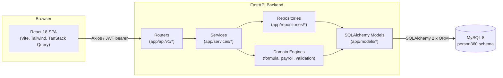
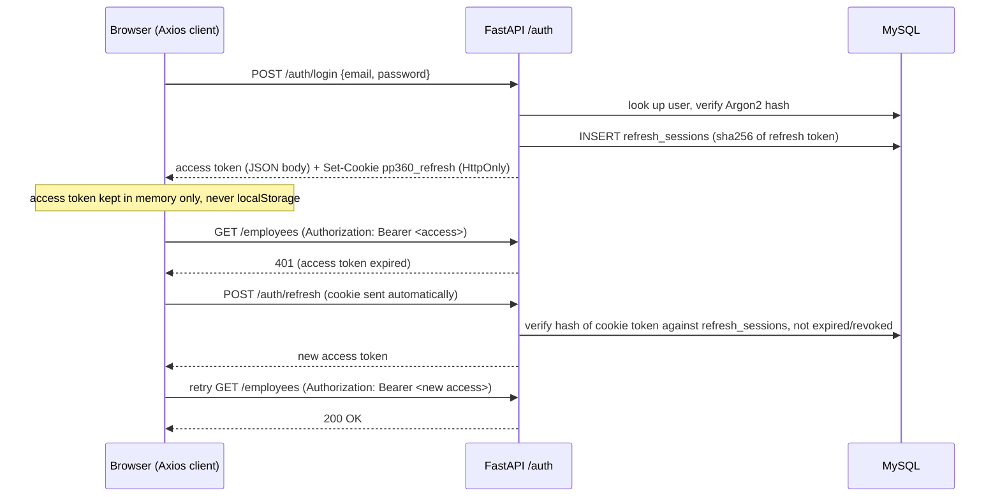

# System Architecture

## Overview

PeoplePay360 is a two-tier web application: a React single-page application talking to a
FastAPI backend over a versioned JSON REST API, with MySQL 8 as the sole system of record.
There is no server-rendered HTML, no shared session state on disk, and no background job
queue — every mutation happens synchronously inside a request/response cycle and is
committed to MySQL before the response is returned.



## Backend layering

The backend is organized as a strict top-to-bottom dependency chain. Each layer only calls
the layer(s) below it, never sideways or back up:

1. **Routers** (`app/api/v1/*.py`) — thin FastAPI `APIRouter`s. They parse/validate the
   request with Pydantic schemas, resolve the current user via `app/api/deps.py`, enforce
   the required permission with `require_permission(...)`, call exactly one service method,
   and wrap the result in the standard envelope. Routers contain no business logic and no
   direct SQL/ORM queries.
2. **Services** (`app/services/*.py`) — business logic and transaction boundaries. A service
   method opens/commits/rolls back the SQLAlchemy session, raises typed `AppError`
   subclasses (`NotFoundError`, `ConflictError`, `ValidationError`, `PermissionError`, ...)
   on failure, and orchestrates repositories and engines. Every state-changing operation
   (approve leave, compute a payrun, mark paid, ...) lives here.
3. **Repositories** (`app/repositories/*.py`) — encapsulate non-trivial or reused queries,
   most importantly contract period resolution and overlap detection
   (`contract_repository.py`). Simple CRUD that doesn't need reuse is queried directly
   inside the owning service to avoid a proliferation of one-line wrapper methods; the
   pattern exists specifically where query correctness matters (date-range overlap logic).
4. **Domain engines** (`app/engines/*.py`) — pure(-ish) computation with no HTTP awareness:
   - `formula_engine.py` — the AST-based safe formula evaluator used by salary rules.
   - `payroll_engine.py` — computes a single payslip's lines from a resolved contract,
     structure, and attendance/time-off inputs.
   - `payroll_validation_engine.py` — checks a computed payrun for blocking/non-blocking
     warnings before it can be validated.
5. **Models** (`app/models/*.py`) — SQLAlchemy 2.0 declarative models (`Mapped` /
   `mapped_column`) that map 1:1 to MySQL tables. All monetary columns use
   `Numeric(15, 2)`; the ORM and services exchange `Decimal`, never `float`.

Cross-cutting concerns live in `app/core/`: `security.py` (Argon2 hashing, JWT
issue/verify), `permissions.py` (the permission catalogue and role→permission matrix),
`exceptions.py` (the `AppError` hierarchy and the exception handlers that turn them into the
standard envelope), and `config.py` (`pydantic-settings` reading `.env`).

## Frontend layering

The frontend mirrors the backend's separation of concerns:

1. **Pages** (`src/pages/**`) — one component per route. A page owns layout and local UI
   state (form fields, selected tab, pagination) and reads/writes server state exclusively
   through TanStack Query hooks.
2. **Service modules** (`src/lib/api/services/*.js`) — one module per backend resource
   (`employeeService.js`, `payrollService.js`, ...). Each exported function is a thin wrapper
   around an Axios call plus a call to the matching `unwrap*` normalizer — pages never call
   Axios or read `response.data` directly.
3. **Axios client** (`src/lib/api/client.js`) — a single configured instance holding the
   in-memory access token, attaching the `Authorization` header, and implementing the
   401 → refresh-once → retry flow via the `pp360_refresh` HttpOnly cookie. On a failed
   refresh it dispatches a `pp360:session-expired` window event, which `AuthContext`
   listens for to clear state and redirect to `/login`.
4. **Query keys / invalidation** (`src/lib/queryKeys.js`, `src/lib/invalidation.js`) — a
   central map from domain events (e.g. `PAYRUN_COMPUTED`, `LEAVE_APPROVED`) to the query
   keys that must be invalidated, so a mutation in one page reliably refreshes stale data
   shown on another (e.g. approving leave refreshes both the request list and the dashboard).
5. **Auth & routing** (`src/lib/auth/AuthContext.jsx`, `src/routes/RequireAuth.jsx`) —
   `AuthProvider` exposes `user`, `hasPermission`, `hasAnyPermission`, `hasRole`;
   `RequireAuth` redirects unauthenticated users to `/login`, and `RequirePermission` hides
   or blocks UI for users lacking the needed permission (backend still re-checks
   everything — this is UX, not the security boundary).
6. **Forms** — React Hook Form + Zod resolvers (`src/schemas/*.js`) validate on the client
   before submission; the backend's Pydantic schemas are the actual source of truth and
   reject anything the client validation might miss.

## Authentication & session flow



Refresh tokens are never stored in the browser as readable text — only their SHA-256 hash
is persisted server-side in `refresh_sessions`, which also enables server-side revocation
(logout, or an admin forcing logout) independent of the token's own expiry.

## Request/response envelope

Every API response uses one of these shapes, and the frontend's `unwrap*` helpers in
`src/lib/api/normalizers.js` are the single place that understands them:

```json
{ "success": true, "data": { ... } }
{ "success": true, "data": [ ... ], "pagination": { "page": 1, "page_size": 20, "total": 42, "total_pages": 3 } }
{ "success": false, "error": { "code": "CONTRACT_CONFLICT", "message": "...", "fields": null } }
```

## Directory map

```
backend/app/
  api/v1/        FastAPI routers (one file per resource)
  api/deps.py    current-user + permission dependencies
  core/          config, security, permissions catalogue, exception handlers
  db/            SQLAlchemy Base + session factory
  engines/       formula evaluator, payroll compute/validate engines
  models/        SQLAlchemy ORM models
  repositories/  reusable/critical queries (contract resolution)
  schemas/       Pydantic request/response schemas
  services/      business logic + transactions
  utils/         PDF generation, email adapter, serialization helpers
  seed.py        idempotent demo-data seeding script

frontend/src/
  components/    shared UI primitives (Button, Input, Table, ...) + Layout shell
  lib/api/       Axios client, normalizers, per-resource service modules
  lib/auth/      AuthContext
  lib/permissions/ frontend permission-check helpers
  pages/         one folder per module (employees, contracts, payroll, timeoff, ...)
  routes/        RequireAuth / RequirePermission guards
  schemas/       Zod validation schemas
```
