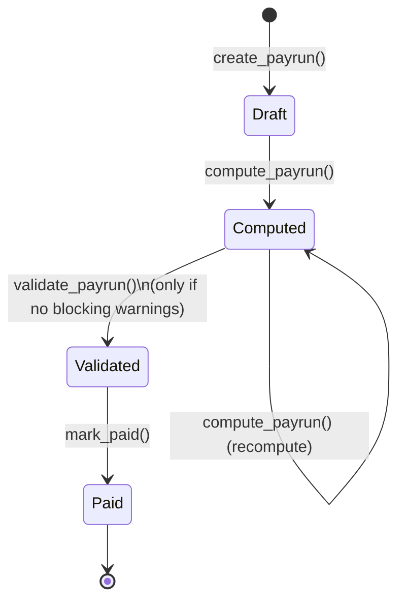

# Business Rules

This document describes the business logic actually implemented in the backend, with
pointers to the exact source file/function so every claim here can be checked against code.

## 1. Contracts: period resolution & overlap prevention

**Files:** `app/repositories/contract_repository.py`, `app/services/contract_service.py`

- Only one contract with status `Active` may exist for a given employee for any given date
  range. `find_overlapping_active_contracts()` is called on both create and update; if it
  returns any rows, the service raises `ConflictError` (`CONTRACT_CONFLICT`) and the
  request is rejected with HTTP 409 — the conflicting contract's reference is included in
  the error so the user can resolve it (e.g. end-date the old contract first).
- A contract's `end_date` may be `NULL`, meaning "open-ended, still active." Overlap and
  applicability queries treat `NULL` as extending to infinity (`Contract.end_date.is_(None)`
  matched with `or_`).
- **Resolving which contract applies to a payroll period** (`get_applicable_contract()`) is
  a distinct operation from overlap prevention at write-time: it queries all `Active`
  contracts for the employee whose range intersects `[period_start, period_end]`. Because
  write-time overlap prevention should make this impossible, finding more than one match at
  read-time is treated as a **data integrity error**, not "pick the newest" — the engine
  raises `ConflictError` (`CONTRACT_CONFLICT`) rather than silently guessing, and the payroll
  engine turns that into a blocking `NO_VALID_CONTRACT`-class warning on the payslip instead
  of crashing the whole payrun computation.

## 2. Working schedules: weekly-hours calculation

**File:** `app/services/schedule_service.py`, `app/models/schedule.py`

- A `WorkingSchedule` has one `ScheduleLine` per weekday (0-6), each with `start_time`,
  `end_time`, `break_hours`, and an `enabled` flag.
- Weekly hours = sum over enabled lines of `(end_time - start_time) - break_hours`. This is
  computed server-side whenever a schedule is created/updated (never trusted from the
  client) and returned as `weekly_hours` in the schedule's response payload, so both the
  Working Schedules list and any place that displays a schedule show a value the backend
  itself derived from the line data, not something the frontend can spoof.

## 3. Salary rules: safe formula evaluation

**File:** `app/engines/formula_engine.py`

- A `SalaryRule` with `computation_type = Formula` stores a plain-text arithmetic expression
  referencing other rule codes in the same structure (e.g. `BASIC * 0.4 + CONV`).
- `SafeFormulaEvaluator` parses the expression with Python's `ast` module and performs a
  **validation pass** before any evaluation: the allowed node types are `Expression`,
  `BinOp` with `{Add, Sub, Mult, Div}`, `UnaryOp` with `{UAdd, USub}`, `Name`, and `Constant`
  (numeric only). Anything else — `Call`, `Attribute`, `Subscript`, `Compare`, `BoolOp`,
  string/list/dict literals, comprehensions, `Import`, lambda, walrus — raises
  `FormulaSecurityError` and the rule is rejected at save time, before it can ever reach
  evaluation. There is no `eval()` or `exec()` call anywhere in the codebase.
- Only after validation does the evaluator resolve `Name` nodes against the other rules'
  already-computed amounts for that payslip and evaluate using `Decimal` arithmetic — never
  `float` — so a formula rule's output is exact to the cent.
- A formula referencing an unknown rule code raises `FormulaEvaluationError` and blocks that
  payslip's computation with a clear message rather than defaulting to zero silently.

## 4. Payroll: eligibility, computation, and the state machine

**Files:** `app/services/payroll_service.py`, `app/engines/payroll_engine.py`,
`app/engines/payroll_validation_engine.py`, `app/models/payroll.py`

### 4.1 The two-step wizard never creates a Payrun on step 1

- `compute_eligibility(...)` (step 1 — "Continue") only **reads** data: it resolves, for
  every candidate employee in the chosen department/period, whether they have an applicable
  active contract, and returns an eligibility table (`eligible: true/false` + reason). It
  performs **no writes** — no `Payrun` row, no `Payslip` rows. This is enforced both by the
  route only calling a read-only service function, and by a frontend test
  (`PayrunWizardPage.test.jsx`) asserting `createPayrun` is never called merely by loading
  the wizard.
- `create_payrun(...)` (step 2 — "Create Payrun (N)") is the **only** function that inserts a
  `Payrun` row and its child `Payslip` rows, and it is only invoked when the user explicitly
  submits the selected-employees list from step 2.

### 4.2 Duplicate-payslip prevention

- `create_payrun()` silently skips any employee who already has a `Payslip` for the exact
  same `(period_start, period_end)`, rather than erroring the whole batch — this lets a
  payroll user re-run "create payrun" for a period after adding a late-joining employee
  without duplicating everyone else. The response reports how many were created vs. skipped.
- The database also enforces this at the schema level with a unique constraint on
  `payslips (payrun_id, employee_id)`, and the validation engine additionally flags a
  `DUPLICATE_PAYSLIP` **blocking** warning if a payslip covering the identical period exists
  outside the current payrun (e.g. from a different payrun object).

### 4.3 State machine

`PAYRUN_TRANSITIONS` in `app/models/payroll.py` is a plain dict of legal target states per
current state (`Draft → {Computed}`, `Computed → {Computed, Validated}`,
`Validated → {Paid}`, `Paid → {}`). `payroll_service._assert_transition()` checks the current
status against this table before any state-changing service function runs and raises
`ConflictError` (`INVALID_TRANSITION`) otherwise. This check is **server-side and
unconditional** — it runs regardless of what the frontend's button visibility allows, so a
direct API call attempting e.g. `Paid → Computed` is rejected with the same error whether it
comes from the UI or a raw HTTP client.

- **Compute** (`compute_payrun`): for every payslip in the payrun, resolves the applicable
  contract, runs the salary structure's rules through the formula engine in `sequence`
  order, sums earnings/deductions into `gross_total`/`net_total` (`Decimal`, rounded
  `ROUND_HALF_UP` to 2 places), attaches any warnings from
  `payroll_validation_engine.build_warnings()`, and sets each payslip (and the payrun once
  all are done) to `Computed`.
- **Validate** (`validate_payrun`): only allowed from `Computed`, and only succeeds if every
  payslip is `Computed` (not still `Draft`) **and** none carries a `blocking` warning. If any
  payslip has a blocking warning (missing contract, unresolved duplicate), validation is
  rejected with the offending employee names listed, forcing the user back to fix data
  before proceeding — non-blocking warnings (missing bank details, incomplete employee
  profile) are shown but do not prevent validation.
- **Mark Paid** (`mark_paid`): only allowed from `Validated`. Sets payrun and all payslips to
  `Paid`. This is a one-way door — `PAYRUN_TRANSITIONS[Paid]` is empty, so no further
  transition is possible.
- **Send payslips** (`send_payslips`): attempts to email each payslip via
  `utils/email_adapter.py`. If SMTP is not configured (`Settings.smtp_configured` is
  `False`), it returns a status of `EMAIL_NOT_CONFIGURED` for every recipient rather than
  reporting `sent` — the system never claims a delivery it did not actually perform.

## 5. Time off: atomic approval transaction

**File:** `app/services/timeoff_service.py::approve_request`

This is the most concurrency-sensitive function in the codebase, implementing the required
"no double-approval / no double-consumption" guarantee:

1. `SELECT ... FOR UPDATE` locks the specific `TimeOffRequest` row.
2. Re-check `request.status == TO_APPROVE` **after acquiring the lock** — if a concurrent
   request already approved/refused it, this raises `ConflictError` ("already been decided"),
   preventing two simultaneous approve calls from both succeeding.
3. If the time-off type `requires_allocation`, resolve a single `Approved` allocation for
   that employee/type whose validity window covers the request's dates, also taken with
   `SELECT ... FOR UPDATE` — locking the allocation row prevents a second concurrent
   approval (for a different request against the same allocation) from reading a stale
   `remaining` balance.
4. If no covering allocation exists, raise `ConflictError` (`NO_VALID_ALLOCATION`) — the
   request cannot be approved without one.
5. If the allocation's `remaining` balance is less than the requested duration and the type
   does not `allow_negative`, raise `ConflictError` (`INSUFFICIENT_BALANCE`).
6. Only after all checks pass: increment `allocation.taken`, set
   `request.status = Approved`, write the audit log entry, and create a notification for the
   employee — all inside the same database transaction, so any failure anywhere in this
   sequence rolls back every part of it (no half-approved state is ever persisted).

Refusal (`refuse_request`) follows the same lock-then-recheck pattern without touching any
allocation balance.

## 6. Audit logging

**File:** `app/services/audit_service.py`

Every sensitive state change (contract create/update, allocation approve/refuse, time-off
request submit/approve/refuse, payrun compute/validate/mark-paid, user role changes) writes
an `AuditLog` row capturing `actor_user_id`, `action`, `entity_type`, `entity_id`, and JSON
`before`/`after` snapshots. Non-JSON-native values (dates, Decimals, enums) are passed
through `utils/serialization.py::to_jsonable()` first so the write never fails on a
serialization error.

## 7. Notifications

**File:** `app/services/notification_service.py`, `app/models/notification.py`

Notifications are plain database rows (`user_id`, `title`, `body`, `category`, `link`,
`read`), created inside the same transaction as the business event that triggers them (leave
submitted/approved/refused, etc.) and surfaced to the frontend by polling
`GET /notifications` — there is no WebSocket/push channel, which is disclosed as a known
limitation rather than implied to exist.

## 8. Money handling

Every monetary column in the schema (`contracts.wage`, allocation/attendance decimal
amounts, `payslips.gross_total`/`net_total`, `payslip_lines.amount`) is `Numeric(15, 2)` in
MySQL and `Decimal` in Python end-to-end — arithmetic in the payroll and formula engines
uses `decimal.Decimal` exclusively, with explicit `.quantize(Decimal('0.01'),
rounding=ROUND_HALF_UP)` at the point a rule's computed amount is stored. `float` is never
used for a currency value anywhere in the backend.
