# Entity-Relationship Diagram

This reflects the actual SQLAlchemy models in `backend/app/models/`, which Alembic's
`7fa34af897cf_initial_schema` migration creates verbatim in MySQL 8. It is not a
simplified/idealized diagram — every table, foreign key, and cardinality below exists in
the shipped schema.

```mermaid
erDiagram
    USERS ||--o{ USER_ROLES : has
    ROLES ||--o{ USER_ROLES : has
    ROLES ||--o{ ROLE_PERMISSIONS : has
    PERMISSIONS ||--o{ ROLE_PERMISSIONS : has
    USERS ||--o{ REFRESH_SESSIONS : owns
    USERS ||--o| EMPLOYEES : "linked account"
    USERS ||--o{ AUDIT_LOGS : "acted as"
    USERS ||--o{ NOTIFICATIONS : receives

    DEPARTMENTS ||--o{ EMPLOYEES : employs
    JOB_POSITIONS ||--o{ EMPLOYEES : "held by"
    EMPLOYEE_TYPES ||--o{ EMPLOYEES : classifies
    WORKING_SCHEDULES ||--o{ EMPLOYEES : "default schedule"
    EMPLOYEES ||--o{ EMPLOYEES : "manager of"

    WORKING_SCHEDULES ||--o{ SCHEDULE_LINES : "has days"

    EMPLOYEES ||--o{ CONTRACTS : has
    DEPARTMENTS ||--o{ CONTRACTS : "assigned dept"
    JOB_POSITIONS ||--o{ CONTRACTS : "assigned position"
    SALARY_STRUCTURES ||--o{ CONTRACTS : "uses structure"
    WORKING_SCHEDULES ||--o{ CONTRACTS : "uses schedule"

    EMPLOYEES ||--o{ ATTENDANCES : logs

    TIME_OFF_TYPES ||--o{ TIME_OFF_ALLOCATIONS : grants
    EMPLOYEES ||--o{ TIME_OFF_ALLOCATIONS : receives
    TIME_OFF_TYPES ||--o{ TIME_OFF_REQUESTS : "requested as"
    EMPLOYEES ||--o{ TIME_OFF_REQUESTS : submits
    TIME_OFF_ALLOCATIONS ||--o{ TIME_OFF_REQUESTS : consumes
    USERS ||--o{ TIME_OFF_REQUESTS : decides

    SALARY_STRUCTURES ||--o{ SALARY_RULES : contains

    SALARY_STRUCTURES ||--o{ PAYRUNS : "computed with"
    DEPARTMENTS ||--o{ PAYRUNS : "scoped to"
    USERS ||--o{ PAYRUNS : "created by"
    PAYRUNS ||--o{ PAYSLIPS : contains
    EMPLOYEES ||--o{ PAYSLIPS : "belongs to"
    CONTRACTS ||--o{ PAYSLIPS : "resolved from"
    PAYSLIPS ||--o{ PAYSLIP_LINES : "line items"
    SALARY_RULES ||--o{ PAYSLIP_LINES : "computed by"

    USERS {
        int id PK
        string email UK
        string password_hash
        bool is_active
        datetime created_at
    }
    ROLES {
        int id PK
        string name UK
    }
    PERMISSIONS {
        int id PK
        string code UK
        string description
    }
    USER_ROLES {
        int user_id FK
        int role_id FK
    }
    ROLE_PERMISSIONS {
        int role_id FK
        int permission_id FK
    }
    REFRESH_SESSIONS {
        int id PK
        int user_id FK
        string token_hash
        datetime expires_at
        bool revoked
    }
    EMPLOYEES {
        int id PK
        int user_id FK "nullable, unique"
        string code UK
        string name
        string email
        int department_id FK
        int job_position_id FK
        int manager_id FK "self-reference"
        int employee_type_id FK
        int working_schedule_id FK
        bool active
    }
    CONTRACTS {
        int id PK
        int employee_id FK
        string reference
        date start_date
        date end_date "nullable = open-ended"
        decimal wage
        enum status "Draft/Active/Expired/Cancelled"
        int department_id FK
        int job_position_id FK
        int salary_structure_id FK
        int working_schedule_id FK
    }
    WORKING_SCHEDULES {
        int id PK
        string name
        enum schedule_type "FullTime/PartTime/Custom"
    }
    SCHEDULE_LINES {
        int id PK
        int schedule_id FK
        int weekday "0-6"
        time start_time
        time end_time
        decimal break_hours
        bool enabled
    }
    ATTENDANCES {
        int id PK
        int employee_id FK
        date work_date
        datetime check_in
        datetime check_out
        enum status "Present/Late/Absent/Overtime/MissingCheckout"
        bool manually_corrected
    }
    TIME_OFF_TYPES {
        int id PK
        string code UK
        string name
        enum unit "Days/Hours"
        bool requires_allocation
    }
    TIME_OFF_ALLOCATIONS {
        int id PK
        int employee_id FK
        int time_off_type_id FK
        decimal allocated_amount
        decimal consumed_amount
        enum status "Draft/Approved/Refused"
    }
    TIME_OFF_REQUESTS {
        int id PK
        int employee_id FK
        int time_off_type_id FK
        int allocation_id FK "nullable until resolved"
        date start_date
        date end_date
        decimal amount
        enum status "Pending/Approved/Refused/Cancelled"
        int decided_by_user_id FK
    }
    SALARY_STRUCTURES {
        int id PK
        string code UK
        string name
        bool active
    }
    SALARY_RULES {
        int id PK
        int structure_id FK
        string code
        string name
        enum category "Earning/Deduction/Contribution"
        enum computation_type "Fixed/Percentage/Formula"
        string formula_text "nullable"
        int sequence
    }
    PAYRUNS {
        int id PK
        string name
        date period_start
        date period_end
        int salary_structure_id FK
        int department_id FK "nullable"
        enum status "Draft/Computed/Validated/Paid"
        int created_by_user_id FK
    }
    PAYSLIPS {
        int id PK
        int payrun_id FK
        int employee_id FK
        int contract_id FK "nullable"
        decimal gross_total
        decimal net_total
        enum status "Draft/Computed/Validated/Paid"
        json warnings
    }
    PAYSLIP_LINES {
        int id PK
        int payslip_id FK
        int salary_rule_id FK "nullable"
        string code
        string label
        decimal amount
    }
    DEPARTMENTS {
        int id PK
        string name UK
    }
    JOB_POSITIONS {
        int id PK
        string title
    }
    EMPLOYEE_TYPES {
        int id PK
        string name
    }
    AUDIT_LOGS {
        int id PK
        int actor_user_id FK "nullable"
        string action
        string entity_type
        int entity_id
        json before
        json after
        datetime created_at
    }
    NOTIFICATIONS {
        int id PK
        int user_id FK
        string title
        string body
        bool read
        datetime created_at
    }
```

## Notes on key constraints

- `payslips` carries a unique constraint on `(payrun_id, employee_id)` — this is the
  database-level backstop for the duplicate-payslip prevention rule enforced first in
  `payroll_service.create_payrun()`.
- `contracts.end_date` is nullable to represent an open-ended active contract. Overlap
  detection in `contract_repository.find_overlapping_active_contracts()` treats a NULL
  `end_date` as "extends to infinity" when checking for conflicts against other Active
  contracts for the same employee.
- `time_off_requests.allocation_id` is nullable because a request is created (Pending)
  before an allocation is definitively resolved and locked; it is populated as part of the
  atomic approval transaction in `timeoff_service.approve_request()`.
- `employees.manager_id` self-references `employees.id`, modeled in SQLAlchemy with
  `remote_side=[id]`.
- All monetary columns (`contracts.wage`, `time_off_allocations.allocated_amount` /
  `consumed_amount`, `payslips.gross_total` / `net_total`, `payslip_lines.amount`) are
  `Numeric(15, 2)` — never `FLOAT` or `DOUBLE`.
